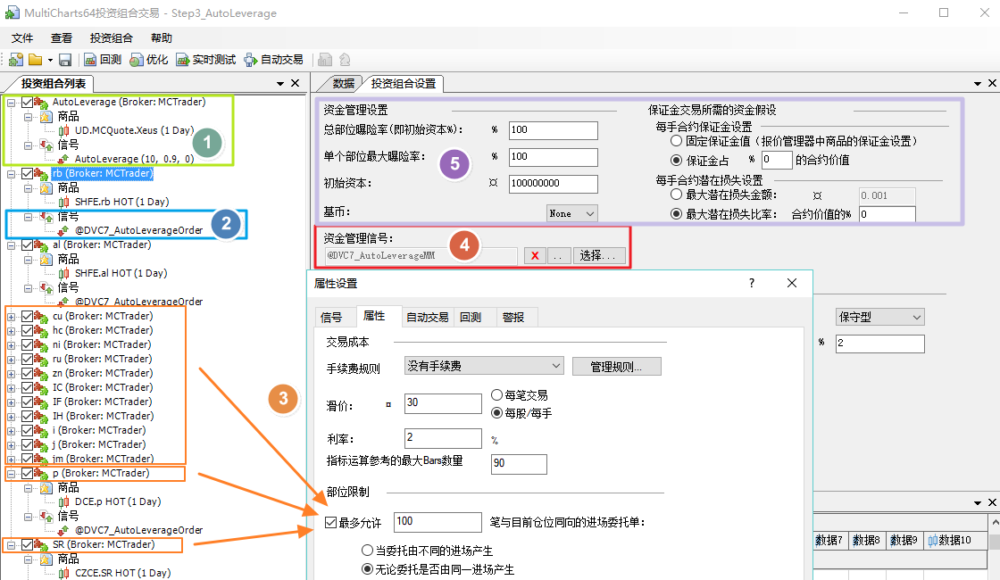
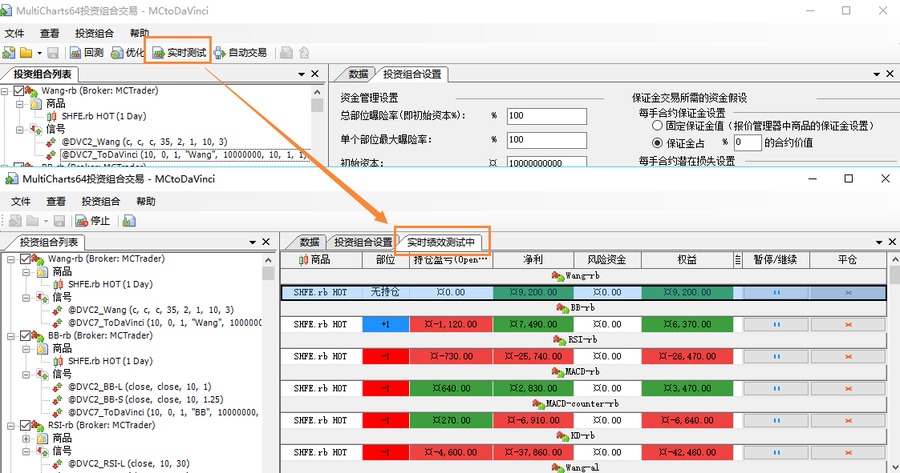
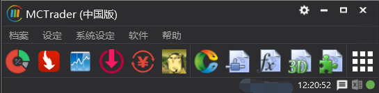
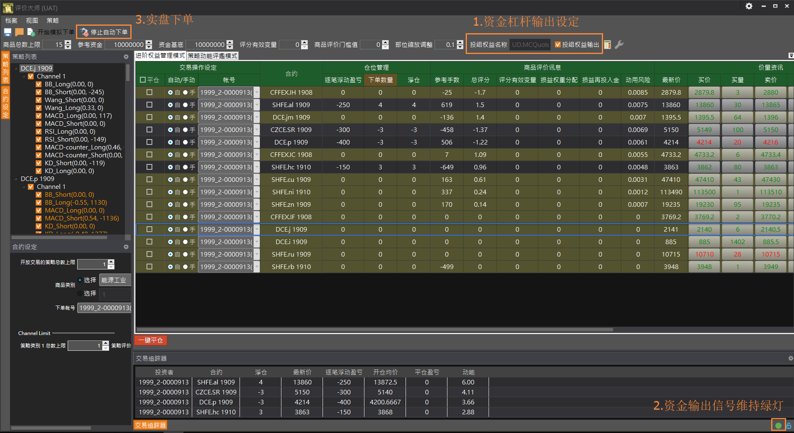
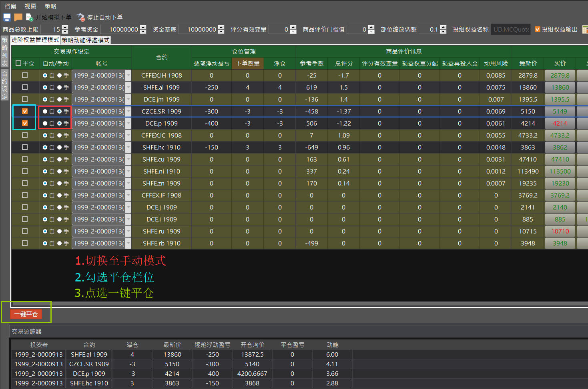

# 肆、完整操作流程

## 一、MC 回测模板

### 步骤1: 拆解多空权益数（PT-Step1）

1. 插入所有要交易的商品及交易信号\(红框\)，不同的信号应置于不同strategy。
2. 每个Strategy都要插入共同信号**@DVC5\_PassEq**\(橘框\)，以进行多空权益分。
3. **@DVC5\_OriginalMM**为选用信号，可将原策略组合绩效输出至MC图表上观察\(蓝框\)。 （QM设定参考步骤5）
4. 投资组合的资金管理设置,避免内建管理设定造成信号无法产生\(如紫框\)：
   * 总部位曝险率\(Exposure % of Portfolio Capital\)=100%
   * 单个部位最大曝险率\(Max % of Capital at Risk per Position\)=100%
   * 每手合约保证金设置\(Margin per Contract\) = 0%
   * 每手合约潜在损失设置\(Potential Loss per Contrac\)=0%
5. 设定初始资金\(绿框\)。
6. 需注意交易周期最小者要摆置于最上方，如30分K的策略要放在日K策略之前。
7. 设定完成后即可储存为Step1 PT档案。
8. 使用图表版的用户，仅须挂载自定义交易信号及共同信号**@DVC5\_PassEq\_Chart**，即可进行步骤2。

### 步骤2: 策略整合&商品管理（PT-Step2）

1. 单商品PT
   * 新建一个PT，依照Step1中的策略摆放顺序，依序建立策略，Step1采用图表的的用户，请依照**@DVC5\_PassEq\_Chart**中的参数编号依序建立策略顺序，最後插入**@DVC7\_Set**信号，以计算评分及风平口数。
   * 在最下方新增一个strategy，插入**@DVC7\_Order**信号作为策略整合及下单使用\(如图一\)，如果该商品多个策略使用不同周期，请将此strategy的周期设为该商品各策略之中的最小周期。
   * 后在右方管理信号插入**@DVC7\_XeusMM**。
   * 如欲进行Step3自动杠杆调整，则依照步骤5，先行在QM建立Step2的资金商品（必须）。
2. 多商品PT：若交易多商品，则重复上述动作\(如图二\) 。
3. PT策略属性设置：使用**@DVC7\_Order**的商品，须在策略属性设置中，将部位限制选项打勾，开启加仓功能\(如图三\)。
4. 注意初始资金设定与Step1 PT要相同。

### 步骤3: 自动杠杆调整\(选用功能，若不进行自动杠杆调整，则直接跳到步骤4\)（PT-Step3）

1. 新建PT，在最上方的Strategy插入刚刚QM新建的商品及**AutoLeverage**信号\(如绿框\)。
2. 其余Strategy插入所有交易商品，并插入信号**@DVC7\_AutoLeverageOrder**\(蓝框\)。
3. **@DVC7\_AutoLeverageOrder**的策略同时开启加仓功能\(橘框\)。
4. 最后在右方MM管理信号插入**@DVC7\_AutoLeverageMM**信号\(红框\)。
5. 注意初始资金等资金管理设定与Step2 PT相同。

### 步骤4:  三个PT依序执行“实时测试”，即可观看回测结果。

### 步骤5: QM增加绩效商品\(选用功能，若不进行绩效MC图表化展示，则跳过本步骤\)

1. 建立Step1原始绩效商品：
   * 在QM报价管理器新建一个商品，名称与Step1中 ****@**DVC5\_OriginalMM**中的**CapitalName**相同（比如：UD.MCQuote.Original）
   * 数据源选择MCTrader，交易时段设定需涵盖投组内所有商品的交易时段。
2. 建立Step2 整合后的绩效商品（如果用Step3，这步必须有）：
   * 在QM报价管理器新建一个商品，名称与Step2 中 **@DVC7\_XeusMM**中的**CapitalName**相同（比如：UD.MCQuote.Xeus）
   * 数据源选择MCTrader，交易时段设定需涵盖投组内所有商品的交易时段。
3. 建立Step3 自动杠杆增加后的绩效商品：

   * 在QM报价管理器新建一个商品，名称与Step3 中 **@DVC7\_AutoLeverageMM**中的**CapitalName**相同（比如：UD.MCQuote.AutoLeverage）
   * 数据源选择MCTrader，交易时段设定需涵盖投组内所有商品的交易时段。

### 步骤6: MC图表绘制绩效曲线\(选用功能，若不进行绩效MC图表化展示，则跳过本步骤\)

1. 开启MC图表UD.MCQuote.Original商品，需要与PT Step1的商品周期相同（绿色收盘线）
2. 插入子图商品 UD.MCQuote.Xeus（粉色收盘线）
3. 插入子图商品 UD.MCQuote.AutoLeverage（橙色收盘线）

## 二、MC 与 评价大师 实盘模板

### 步骤1 \( PT端 \)

1. 插入所有要交易的商品\(如绿框\)。
2. 插入交易信号\(如红框\)，不同的信号应置于不同strategy。
3. 每个Strategy都要插入共同信号**@DVC7\_ToDaVinc**i\(蓝框\)。
4. 设置资金管理\(如紫框\)：
   * 总部位曝险率\(Exposure\(% of Portfolio Capital\)=100%
   * 单个部位最大曝险率\(Max % of Capital at Risk per Position\)=100%
   * 每手合约保证金设置\(Margin per Contract\) = 0%
   * 每手合约潜在损失设置\(Potential Loss per Contrac\)=0%
   * 初始资本：尽量大的设定
5. 需注意交易周期最小者要摆置于最上方，如30分K的策略要放在日K策略之前。
6.  使用图表版的用户，仅须挂载自定义交易信号及共同信号**@DVC7\_ToDaVinci**，并开启评价大师后，即可进行步骤3。

### 步骤2 \( PT端 \)

按下`实时测试`执行PT，并开启MCTrader上的评价大师AP。

### 步骤3 \( AP端 \)

1. 点选左上方的档案`载入商品`，按下`载入商品` -&gt;`确定`，即可在策略列表看到载入的策略池。若已有储存过设定档，可以选用`档案` -&gt;`载入设定`来读取档案。  
2. 上方参数设定区\(红框\)，可设定资金管理参数。
   * 商品总数上限: 整体投资组合最多可交易的商品数量
   * 参考资金: 策略端计算部位用的初始资金额度。
   * 资金基底: 资金函数实际上调用的金额，并依此值与参考资金的比例，进行比例式下单。
   * 评分有效变量: 评分缓冲区间，当评分变化超过此值，才会调整部位。
   * 商品评价门槛值: 当商品评分超过此门槛，才会进场交易或调整部位。
   * 部位缩放调整: 设定总体组合使用的资金杠杆比率。
   * 投组权益名称: 评价大师评价后之权益曲线名称，资金数据将输出至此商品名，并于MC端进行后续资金缩放演算。
   * 投组权益输出: 勾选此项目，将于进阶权益管理模式下，把权益输出至MC。
3. 左方策略列表\(绿框\)，可观察策略评分&部位，显示如KD\_Short\(评分,部位\)，并可透过勾选方框来选用策略，若该策略有使用负动能评价，则以橘字表示。
4. 点选商品，可以进到下方合约设定\(蓝框\)，可设定策略分组限制、评分门槛及下單帐号等。 

1. 点选右上方的把手，可以设定商品分组限制，及其他进阶功能。
   * 动用风险模式:会预先试算新进商品或新加仓的动用风险，如果会超过风险上限则阻挡。
   * 动用风险上限: 设定整体投资组合使用资金上限。
   * 最大损失比率: 当亏损超过此栏位设定\(资金基底\*N%\)，则强制该商品部位清仓。设定0代表不使用此功能。
   * 损益再投入比率: 将当次交易的部分浮动盈亏，再投入该次资金分配的参考，即当前盈亏评分化的比例。设定0代表不使用此功能。
   * 损益再投入上限: 该次交易的部分浮动盈亏，投入该次资金分配的上限。
   * 未保护商品数: 不受加仓保护垫级距限制的最大信号数量。如不使用保护垫功能，可将此值设定与"商品总数上限"相同。
   * 加仓保护垫级距: 当持仓商品数目达到未保护商品数时，后续每新增一个商品，都会增加一个级距。而整体浮盈须超过"级距总和"才可纳入新商品。 

1. 点选右设定完成后，点选重新计算\(紫框\)，即可在中央画面监控区看到评价大师的计算结果，黑底代表符合下单条件之商品，黄底则否，确认无误后可以先行存档\(左上角档案-&gt;储存设定\)，最后按下下单钮\(绿框\)，即可在"策略动能评鉴模式"下，进行模拟或实盘下单，并可在下方交易追踪器观察目前持仓状态。 

### 步骤4\(MC端\)\(选用\):

若要使用进阶权益管理模式进行自动杠杆调整，则先在MC图表开启资金商品，并针对资金曲线设计算法，输出杠杆位阶送回AP端来即时调整部位缩放及资金基底。

### 步骤5\(AP端\)\(选用\):

在`投组权益名称`栏位里输入与MC端相同之资金商品名称，并勾选`投组权益输出`，确认参数设定无误及右下角輸出燈號保持綠燈，最后按下`开始自动下单`，即可在`进阶权益管理模式`下进行交易权益曲线。下单成功的商品，则可在下方的交易追踪器，观察当前的持仓状态。

## 三、其他操作细节

### \(1\)    手动下单盒

于价量信息栏位中，点选买价、买量、卖价、卖量任一栏位，可开启下单盒进行手动下单，在使用下单盒之前，需确认目前处于非自动下单状态，或是该商品已切换至手动模式。

### \(2\)    手动一键平仓

在自动交易状态下，欲进行多项商品手动平仓，先将该商品切换至手动模式，然后勾选平仓栏位的方框，最后点选底下的"一键平仓"按钮。

### \(3\)    栏位支持隐藏

在商品监控区按鼠标右键，可以开启栏位设定，决定栏位显示与否。

