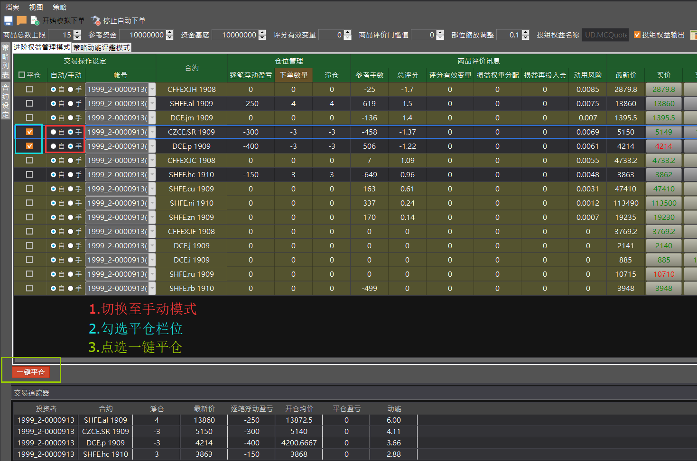

# 肆、完整操作流程

## 一、MC 回測模板

### 步驟1: 拆解多空權益數（PT-Step1）

1. 插入所有要交易的商品及交易信號\(紅框\)，不同的信號應置於不同strategy。
2. 每個Strategy都要插入共同信號**@DVC5\_PassEq**\(橘框\)，以進行多空權益分。
3. **@DVC5\_OriginalMM**為選用信號，可將原策略組合績效輸出至MC圖表上觀察\(藍框\)。 （QM設定參考步驟5）
4. 投資組合的資金管理設置,避免內建管理設定造成信號無法產生\(如紫框\)：
   * 總部位曝險率\(Exposure % of Portfolio Capital\)=100%
   * 單個部位最大曝險率\(Max % of Capital at Risk per Position\)=100%
   * 每手合約保證金設置\(Margin per Contract\) = 0%
   * 每手合約潛在損失設置\(Potential Loss per Contrac\)=0%
5. 設定初始資金\(綠框\)。
6. 需注意交易週期最小者要擺置於最上方，如30分K的策略要放在日K策略之前。
7. 設定完成後即可儲存為Step1 PT檔案。
8. 使用圖表版的用戶，僅須掛載自定義交易信號及共同信號**@DVC5\_PassEq\_Chart**，即可進行步驟2。

### 步驟2: 策略整合&商品管理（PT-Step2）

1. 單商品PT 
   * 新建一個PT，依照Step1中的策略擺放順序，依序建立策略，Step1採用圖表的的用戶，請依照**@DVC5\_PassEq\_Chart**中的參數編號依序建立策略順序，最後插入**@DVC7\_Set**信號，以計算評分及風平口數。 
   * 在最下方新增一個strategy，插入**@DVC7\_Order**信號作為策略整合及下單使用\(如圖4.1.3\)，如果該商品多個策略使用不同周期，請將此strategy的周期設為該商品各策略之中的最小周期。 
   * 後在右方管理信號插入**@DVC7\_XeusMM**。
   *  如欲進行Step3自動槓桿調整，則依照步驟5，先行在QM建立Step2的資金商品（必須）。 
2. 多商品PT：若交易多商品，則重複上述動作\(如圖4.1.4\) 。 PT策略屬性設置：使用**@DVC7\_Order**的商品，須在策略屬性設置中，將部位限制選項打勾，開啟加倉功能\(如圖4.1.5\)。 注意初始資金設定與Step1 PT要相同。
3. PT策略屬性設置：使用**@DVC7\_Order**的商品，須在策略屬性設置中，將部位限制選項打勾，開啟加倉功能\(如圖4.1.5\)。 
4. 注意初始資金設定與Step1 PT要相同。

  

### 步驟3: 自動槓桿調整\(選用功能，若不進行自動槓桿調整，則直接跳到步驟4\)（PT-Step3）

1. 新建PT，在最上方的Strategy插入剛剛QM新建的商品及**AutoLeverage**信號\(如綠框\)。
2. 其餘Strategy插入所有交易商品，並插入信號**@DVC7\_AutoLeverageOrder**\(藍框\)。
3. **@DVC7\_AutoLeverageOrder**的策略同時開啟加倉功能\(橘框\)。
4. 最後在右方MM管理信號插入**@DVC7\_AutoLeverageMM**信號\(紅框\)。
5. 注意初始資金等資金管理設定與Step2 PT相同。

### 步驟4: 三個PT依序執行“實時測試”，即可觀看回測結果。

### 步驟5: QM增加績效商品\(選用功能，若不進行績效MC圖表化展示，則跳過本步驟\)

1. 建立Step1原始績效商品：
   * 在QM報價管理器新建一個商品，名稱與Step1中 **@DVC5\_OriginalMM**中的**CapitalName**相同（比如：UD.MCQuote.Original）
   * 數據源選擇MCTrader，交易時段設定需涵蓋投組內所有商品的交易時段。
2. 建立Step2 整合後的績效商品（如果用Step3，這步必須有）：
   * 在QM報價管理器新建一個商品，名稱與Step2 中 **@DVC7\_XeusMM**中的**CapitalName**相同（比如：UD.MCQuote.Xeus）
   * 數據源選擇MCTrader，交易時段設定需涵蓋投組內所有商品的交易時段。
3. 建立Step3 自動槓桿增加後的績效商品：
   * 在QM報價管理器新建一個商品，名稱與Step3 中 @**DVC7\_AutoLeverageMM**中的**CapitalName**相同（比如：UD.MCQuote.AutoLeverage）
   * 數據源選擇MCTrader，交易時段設定需涵蓋投組內所有商品的交易時段。

### 步驟6: MC圖表繪製績效曲線\(選用功能，若不進行績效MC圖表化展示，則跳過本步驟\)

1. 開啟MC圖表UD.MCQuote.Original商品，需要與PT Step1的商品週期相同（綠色收盤線）
2. 插入子圖商品 UD.MCQuote.Xeus（粉色收盤線）
3. 插入子圖商品 UD.MCQuote.AutoLeverage（橙色收盤線）

## 二、MC 與 評價大師 實盤模板

### 步驟1 \( PT端 \)

1. 插入所有要交易的商品\(如綠框\)。
2. 插入交易信號\(如紅框\)，不同的信號應置於不同strategy。
3. 每個Strategy都要插入共同信號**@DVC7\_ToDaVinci**\(藍框\)。
4. 設置資金管理\(如紫框\)：
   * 總部位曝險率\(Exposure\(% of Portfolio Capital\)=100%
   * 單個部位最大曝險率\(Max % of Capital at Risk per Position\)=100%
   * 每手合約保證金設置\(Margin per Contract\) = 0%
   * 每手合約潛在損失設置\(Potential Loss per Contrac\)=0%
   * 初始資本：盡量大的設定
5. 需注意交易週期最小者要擺置於最上方，如30分K的策略要放在日K策略之前。
6.  使用圖表版的用戶，僅須掛載自定義交易信號及共同信號**@DVC7\_ToDaVinci**，並開啟評價大師後，即可進行步驟3。

### 步驟2 \( PT端 \)

按下`實時測試`執行PT，並開啟MCTrader上的評價大師AP。

### 步驟3 \( AP端 \)

1. 點選左上方的檔案`載入商品`，按下`載入商品` -&gt;`確定`，即可在策略列表看到載入的策略池。若已有儲存過設定檔，可以選用`檔案` -&gt;`載入設定`來讀取檔案。 \(如圖4.2.5\)
2. 上方參數設定區\(紅框\)，可設定資金管理參數。
   * 商品總數上限: 整體投資組合最多可交易的商品數量
   * 參考資金: 策略端計算部位用的初始資金額度。
   * 資金基底: 資金函數實際上調用的金額，並依此值與參考資金的比例，進行比例式下單。
   * 評分有效變量: 評分緩衝區間，當評分變化超過此值，才會調整部位。
   * 商品評價門檻值: 當商品評分超過此門檻，才會進場交易或調整部位。
   * 部位縮放調整: 設定總體組合使用的資金槓桿比率。
   * 投組權益名稱: 評價大師評價後之權益曲線名稱，資金數據將輸出至此商品名，並於MC端進行後續資金縮放演算。
   * 投組權益輸出: 勾選此項目，將於進階權益管理模式下，把權益輸出至MC。
3. 左方策略列表\(綠框\)，可觀察策略評分&部位，顯示如KD\_Short\(評分,部位\)，並可透過勾選方框來選用策略，若該策略有使用負動能評價，則以橘字表示。
4. 點選商品，可以進到下方合約設定\(藍框\)，可設定策略分組限制、評分門檻及下單帳號等。\(如圖4.2.6\)
5. 點選右上方的把手，可以設定商品分組限制，及其他進階功能。\(如圖4.2.7\)
   * 動用風險模式:會預先試算新進商品或新加倉的動用風險，如果會超過風險上限則阻擋。
   * 動用風險上限: 設定整體投資組合使用資金上限。
   * 最大損失比率: 當虧損超過此欄位設定\(資金基底\*N%\)，則強制該商品部位清倉。設定0代表不使用此功能。
   * 損益再投入比率: 將當次交易的部分浮動盈虧，再投入該次資金分配的參考，即當前盈虧評分化的比例。設定0代表不使用此功能。
   * 損益再投入上限: 該次交易的部分浮動盈虧，投入該次資金分配的上限。
   * 未保護商品數: 不受加倉保護墊級距限制的最大信號數量。如不使用保護墊功能，可將此值設定與"商品總數上限"相同。
   * 加倉保護墊級距: 當持倉商品數目達到未保護商品數時，後續每新增一個商品，都會增加一個級距。而整體浮盈須超過"級距總和"才可納入新商品。 
6. 點選右設定完成後，點選重新計算\(紫框\)，即可在中央畫面監控區看到評價大師的計算結果，黑底代表符合下單條件之商品，黃底則否，確認無誤後可以先行存檔\(左上角檔案-&gt;儲存設定\)，最後按下下單鈕\(綠框\)，即可在"策略動能評鑑模式"下，進行模擬或實盤下單，並可在下方交易追踪器觀察目前持倉狀態。 \(如圖4.2.8\)

### 步驟4\(MC端\)\(選用\):

若要使用進階權益管理模式進行自動槓桿調整，則先在MC圖表開啟資金商品，並針對資金曲線設計算法，輸出槓杆位階送回AP端來即時調整部位縮放及資金基底。

### 步驟5\(AP端\)\(選用\):

在`投組權益名稱`欄位裡輸入與MC端相同之資金商品名稱，並勾選`投組權益輸出`，確認參數設定無誤及右下角輸出燈號保持綠燈，最後按下`開始自動下單`，即可在`進階權益管理模式`下進行交易權益曲線。下單成功的商品，則可在下方的交易追踪器，觀察當前的持持倉狀態。  

## 三、其他操作細節 

### \(1\) 手動下單盒 

於價量信息欄位中，點選買價、買量、賣價、賣量任一欄位，可開啟下單盒進行手動下單，在使用下單盒之前，需確認目前處於非自動下單狀態，或是該商品已切換至手動模式。

### \(2\) 手動一鍵平倉 

在自動交易狀態下，欲進行多項商品手動平倉，先將該商品切換至手動模式，然後勾選平倉欄位的方框，最後點選底下的"一鍵平倉"按鈕。

### \(3\)    欄位支持隱藏 

在商品監控區按鼠標右鍵，可以開啟欄位設定，決定欄位顯示與否。

